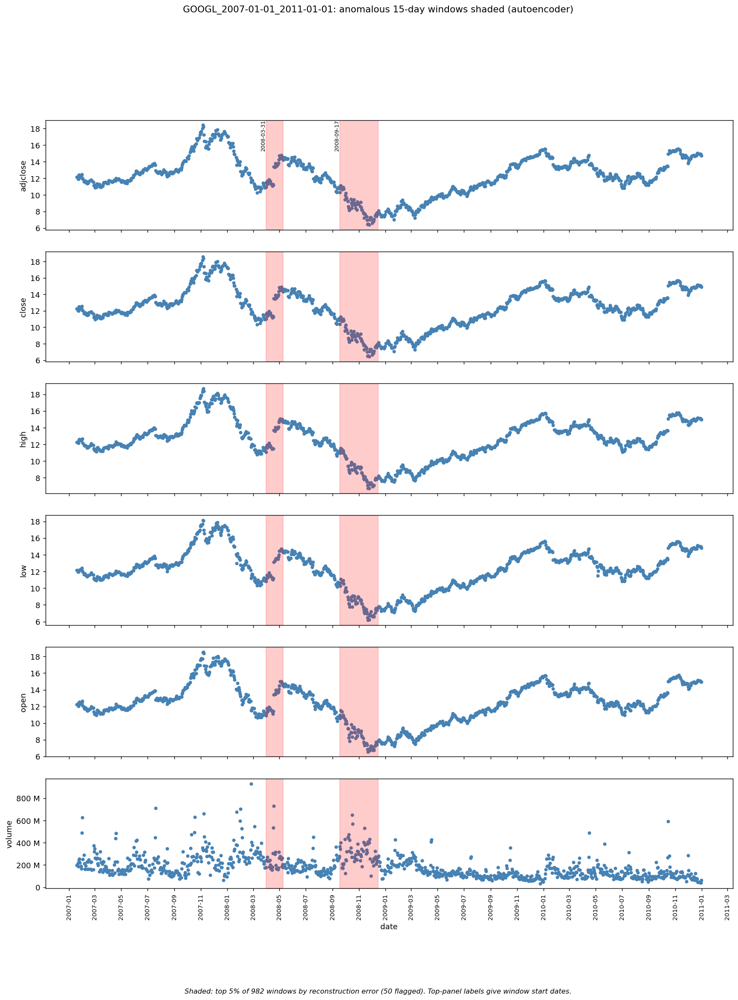
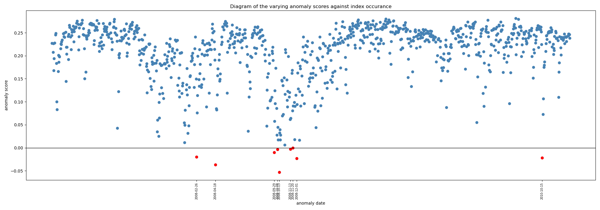
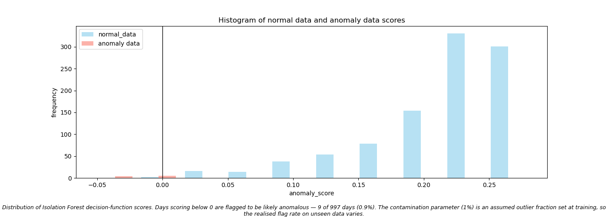
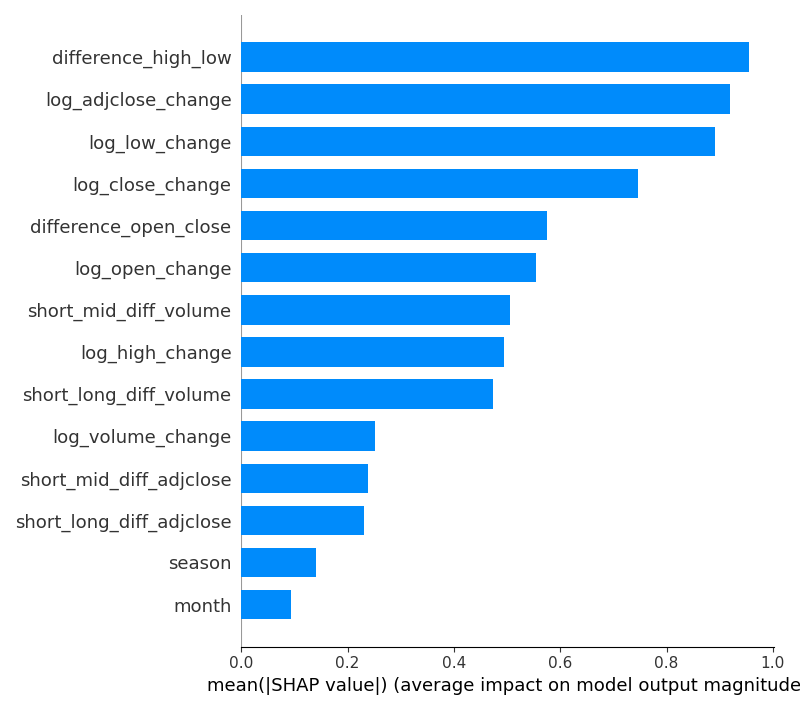

# Finomaly — Anomaly Detection in Financial Market Data

A terminal-based Python tool that trains two unsupervised ML models — an Isolation Forest and an autoencoder — on historical OHLCV time series, and flags anomalous trading periods in unseen market data. Aimed at quantitative analysts and ML researchers.

---



*Autoencoder output for GOOGL, 2007–2011 (a period not used in training). Red bands are the 15-day windows with the highest reconstruction error.*

---

## Key results

- **Training corpus:** 50 assets of daily data from 2015-01-01 to 2021-01-01, covering large-cap equities (e.g. AAPL, JPM, XOM), index ETFs (SPY, QQQ), commodity futures (gold, silver, copper, crude oil, natural gas) and cryptocurrencies (BTC-USD, ETH-USD).
- **Autoencoder on GOOGL 2007–2011:** of 982 sliding 15-day windows, the 50 with the highest reconstruction error (top 5%) were flagged. They form two periods, starting 2008-03-31 and 2008-09-17. The second spans the September–December 2008 sell-off that followed the collapse of Lehman Brothers on 15 September 2008.
- **Isolation Forest on GOOGL 2007–2011:** 9 of 997 trading days (0.9%) were flagged. Six fall between 29 September and 1 December 2008, the most volatile stretch of the financial crisis. Two others, 18 April 2008 and 15 October 2010, were the trading days after Google's quarterly earnings announcements.
- **The two models agree:** both flagged April 2008 and autumn 2008, even though they work differently (single days for the Isolation Forest, 15-day windows for the autoencoder).

---

## Quickstart

### 1. Install dependencies

Requires Python 3.12. CPU is the default supported configuration (see [Hardware](#hardware)).

```bash
pip install -r requirements.txt
```

### 2. Get training data

Market data is not included in this repository. Use menu option `[0]` to download data from Yahoo Finance, or add your own CSV files (see [Data format](#data-format)).

Training needs **at least 10 valid CSV files** in:

```
me245/CSV_Files_training_unverified/
```

Files you want predictions for go in:

```
me245/CSV_Files_unseen_dataset/
```

### 3. Run

Run the program from **inside the `me245` folder**, as all data and output paths are relative to it:

```bash
cd me245
python ui_controller.py
```

Menu options:

```
[0] Extract stock market data  — download OHLCV data from Yahoo Finance
[1] Isolation Forest           — train the classical model, generate predictions, optionally save the model
[2] Autoencoder                — train the deep learning model, generate predictions, optionally save the model
[3] Load model                 — load a saved model and go straight to predictions (in progress)
```

---

## Project structure

| File | Responsibility |
|---|---|
| `ui_controller.py` | Entry point and terminal menu; runs the train → predict → save flow |
| `data_loader.py` | Downloads data from Yahoo Finance and validates CSV files |
| `preprocessor.py` | Feature engineering and sliding-window creation |
| `machine_learning_model.py` | Abstract base class defining the interface every model implements |
| `isolation_forest_manager.py` | Isolation Forest training, prediction, saving and loading |
| `autoencoder.py` | Autoencoder network architecture (PyTorch) |
| `autoencoder_model_manager.py` | Autoencoder training, prediction, saving and loading |
| `interpretation.py` | Charts and SHAP explanations |

---

## How it works

### Data loading (`data_loader.py`)

- **Automatic download:** enter one or more ticker symbols (e.g. `AAPL`, `^GSPC`) and a date range. Each ticker is downloaded separately via `yfinance`, so one failed request does not lose the others, and the program pauses 5 seconds after each batch of downloads to avoid rate limiting. Files are saved as `<TICKER>_<start>_<end>.csv`, so the asset and date range can be read from the file name.
- **Manual CSV:** drop your own files into the unverified folder. Validation runs automatically and moves passing files to the verified folder.
- **Validation rules:** required columns `date`, `open`, `high`, `low`, `close`, `adjclose`, `volume`; at least 1,000 rows; duplicate dates removed; chronological order enforced. Files that fail stay in the unverified folder.

Missing values are not imputed; rows with gaps are dropped. Methods such as linear interpolation or forward-fill would introduce artificial regularity that could hide genuine anomalies.

### Feature engineering (`preprocessor.py`)

Raw OHLCV values are transformed into 14 normalised features per trading day before being passed to either model.

| Feature group | Features | Rationale |
|---|---|---|
| Log returns | `log_adjclose_change`, `log_open_change`, `log_high_change`, `log_low_change`, `log_close_change`, `log_volume_change` | Raw price levels are non-stationary and strongly autocorrelated; log returns are approximately stationary and comparable across assets |
| Rolling divergence | `short_mid_diff_adjclose`, `short_long_diff_adjclose`, `short_mid_diff_volume`, `short_long_diff_volume` | Divergence between short (3-day), medium (6-day) and long (12-day) rolling means; detects momentum shifts in price and volume |
| Intraday structure | `difference_open_close`, `difference_high_low` | Intraday movement and range relative to the open price |
| Seasonal | `month`, `season` | Encodes recurring seasonal patterns so predictable cyclical behaviour is not flagged as anomalous |

Each file is z-score normalised using its own statistics. This acts as a simple per-asset calibration: every file enters the models with comparable numeric ranges, at the cost of discarding differences in absolute scale and volatility between assets. See [Design decisions](#design-decisions).

### Models

Both models inherit from the abstract base class `MachineLearningModel`, which defines the shared interface: `training_loop`, `prediction`, `save` and `load`. A new model object is created for every training run, so each run starts from scratch.

**Isolation Forest** (`isolation_forest_manager.py`)

All validated training files are feature-extracted, concatenated into a single DataFrame, and used to fit one `IsolationForest` (200 trees, `n_jobs=-1`). The `contamination` parameter is set to `0.01`: an assumed outlier fraction that tells the model roughly what proportion of points to treat as anomalous, not a significance level. The model gives every trading day a continuous decision-function score; days scoring below zero are labelled anomalous.

**Autoencoder** (`autoencoder.py`, `autoencoder_model_manager.py`)

Each file is converted into overlapping 15-day sliding windows (three trading weeks). Each window (15 days × 14 features = 210 values) is passed through a fully connected encoder–decoder network:

```
Encoder:  210 → 42 (Tanh) → 21 (Tanh)
Decoder:  21  → 42 (Tanh) → 210
```

Tanh activations are used on the hidden layers to preserve the negative values produced by z-score normalisation (ReLU would clip them to zero). The output layer is linear, so reconstructions are not limited to [-1, 1] and extreme z-scores can still be represented. The two-stage encoder (roughly 20% then 10% of the input width) forces real compression while keeping enough capacity to learn general features of a window; sensitivity to these widths has not yet been tested.

The network is trained file by file for 20 epochs per file, in batches of 32 windows, using MSE loss and the Adam optimiser (learning rate 0.0001, gradient clipping at a norm of 1.0).

At prediction time, each window's mean reconstruction error is calculated, and windows above the **95th percentile** of the file's errors are flagged, i.e. the top 5%. Using an empirical quantile avoids assuming the errors are normally distributed (they are right-skewed). Flagged windows that start within 15 days of each other are merged into a single period for plotting.

### Saving and loading models

After predictions, you can save the trained model to `me245/saved_models/`. Each save gets a unique, time-stamped file name, so earlier models are never overwritten:

| Model | Format | Example file name |
|---|---|---|
| Autoencoder | PyTorch `state_dict` | `Autoencoder_2026-10-09_14-30-05.pt` |
| Isolation Forest | `joblib` | `Isolation Forest_2026-10-09_14-31-12.joblib` |

Only the autoencoder's learned weights are saved, not the whole Python object, so a saved file stays loadable even if the code around it is reorganised. It is loaded with `weights_only=True`, which only allows tensors to be deserialised. Only load `.joblib` files you created yourself: joblib uses pickle, which can run code while loading.

---

## Output charts

All charts are saved as `.png` files under `me245/File_of_outcomes/<model>/<asset>/`. The asset folder name is taken from the CSV file name, so the ticker and date range are part of the output path (e.g. `File_of_outcomes/Autoencoder/GOOGL_2007-01-01_2011-01-01/`).

### Autoencoder

#### `all_features.png` — price and volume with anomalous windows

One figure with six stacked panels (`adjclose`, `close`, `high`, `low`, `open`, `volume`) that share a date axis:

- Steel-blue points: daily values
- Red bands: flagged 15-day windows, with overlapping or nearby windows merged into one band
- Labels on the top panel: the start date of each band
- Caption: how many windows were analysed and how many were flagged

**What to look for:** because the panels share a date axis, you can read straight down a band to see which columns changed during it. A band over a visible spike, drop or change in behaviour in one column, but not the others, points to that column as the main driver.

*Example: GOOGL 2007-01-01 to 2011-01-01 (shown at the top of this README).*

### Isolation Forest

#### `scatter.png` — anomaly score per trading day

X-axis: trading days of the unseen dataset. Y-axis: Isolation Forest decision-function score; more negative means more anomalous. A black line at y = 0 marks the decision boundary.

- Normal days: steel blue
- Anomalous days (score < 0): red, with their dates labelled on the x-axis

**What to look for:** red points clustered in a narrow date range often correspond to identifiable market events such as sharp price moves or unusual volume. Isolated red points scattered across many dates may mean the contamination fraction needs adjusting.



#### `histogram.png` — distribution of decision-function scores

Overlaid histogram of scores for days classified as normal (sky blue) and anomalous (salmon), with the decision boundary at x = 0. A caption gives the number and percentage of days flagged.

**What to look for:** a clear gap between the two groups means the split is meaningful. Heavy overlap near zero means many flagged days are borderline.



#### `shap.png` — SHAP feature importance

Generated with `shap.TreeExplainer` on the fitted Isolation Forest, applied to the anomalous days only. Bars show each feature's mean absolute SHAP value, sorted from most to least important.

**What to look for:** the leading features show what kind of anomaly was detected. Volume-led bars (`log_volume_change`, `short_mid_diff_volume`) suggest volume-driven events; price-led bars (`log_adjclose_change`, `difference_high_low`) suggest price-driven events.



---

## Interpretability

### Isolation Forest: SHAP

`shap.TreeExplainer` works directly with the Isolation Forest because it is a tree ensemble: SHAP follows each tree's split structure to calculate exact feature attributions.

### Autoencoder

SHAP has not yet been applied to the autoencoder. The planned approach is per-feature reconstruction error: comparing the input and the reconstruction feature by feature, to see which features the network failed to reconstruct in each flagged window.

---

## Known limitations

- **The autoencoder always flags 5% of windows.** The threshold is relative to each file's own error distribution, so a calm dataset still has its "top 5%" flagged, and an extremely turbulent one is capped at 5%. Flagged windows are unusual *compared with the rest of that file*, not necessarily in absolute terms.
- **No ground truth.** There are no labelled anomalies in market data, so results are assessed qualitatively against known market events rather than with accuracy metrics.
- **Chart title:** the Isolation Forest scatter plot's title contains a spelling error ("occurance"), which will be corrected in a future update.

---

## Design decisions

**Shared model interface.** `MachineLearningModel` is an abstract base class, so every model must implement `training_loop`, `prediction`, `save` and `load`, and Python refuses to create a model that is missing any of them. The controller receives a model object rather than a model name, so the shared steps (naming outputs, saving, loading) work the same way for both models.

**Separate save formats.** Each model saves in its library's standard format (`joblib` for scikit-learn, a PyTorch `state_dict` for the autoencoder) and adds its own file extension. The extension also tells the loader which model class to create.

**Per-file scaling and training order.** The per-file scaler and the file-by-file training schedule depend on each other: because every file is normalised to the same distribution shape, training on files one after another behaves almost identically to training on them combined. If the scaler were changed to a single fit across the whole corpus, training should move to combined, shuffled windows from all files at the same time; otherwise the files become genuinely different tasks, and training sequentially would bias the model towards the last file trained.

---

## Future work

- Loading saved models from the menu (option `[3]`, in progress)
- Export of flagged rows to CSV
- Per-feature reconstruction error for the autoencoder
- Statistical validation of flagged windows, e.g. comparing lag-1 autocorrelation and volatility in flagged and normal windows
- Unit tests for preprocessing, windowing and save/load
- GPU device placement (`.to(device)`) for the model and batches

---

## Data format

| Requirement | Detail |
|---|---|
| Required columns | `date`, `open`, `high`, `low`, `close`, `adjclose`, `volume` |
| Minimum rows | 1,000 trading days |
| Missing values | Rows with any missing value are dropped |
| Date ordering | Chronological; enforced automatically |
| File naming | `<TICKER>_<YYYY-MM-DD>_<YYYY-MM-DD>.csv` recommended |

The models learn general "normal" behaviour across all training assets, so anomalies are flagged relative to broad market norms, not to a single asset's own history.

---

## Hardware

The code runs entirely on CPU. The autoencoder is small (about 20,000 weights) and trains without a GPU. Saved autoencoders are loaded onto the CPU, so models trained on a GPU machine also load on CPU-only machines. The Isolation Forest uses all available CPU cores (`n_jobs=-1`).

RAM: no minimum is enforced, but Isolation Forest training loads all training files into memory at once. 8 GB or more is advisable for large training sets.

---

## Dependencies

| Library | Purpose |
|---|---|
| `yfinance` | Yahoo Finance OHLCV download |
| `pandas`, `numpy` | Data handling and feature engineering |
| `scikit-learn` | Isolation Forest |
| `joblib` | Saving and loading the Isolation Forest |
| `torch` (PyTorch) | Autoencoder neural network |
| `shap` | Isolation Forest interpretability |
| `matplotlib` | Charts |

See `requirements.txt` for pinned versions.

---

## Legal notice

This project uses `yfinance` to access data via the Yahoo Finance API. `yfinance` is not affiliated with Yahoo. Use is subject to Yahoo's Terms of Service: https://policies.yahoo.com/us/en/yahoo/terms/index.htm. See also the yfinance project page: https://pypi.org/project/yfinance/. Downloaded market data is not redistributed in this repository.
