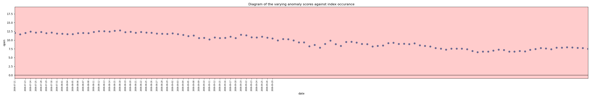
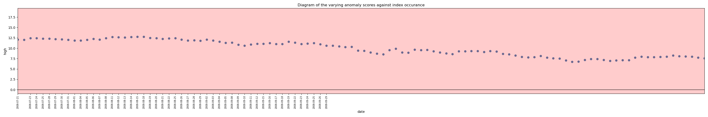
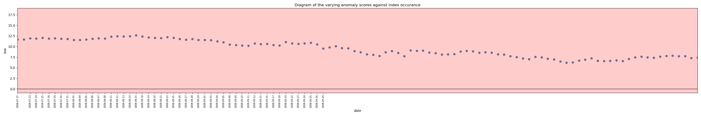
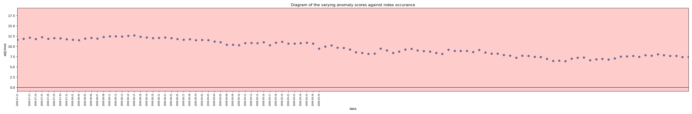
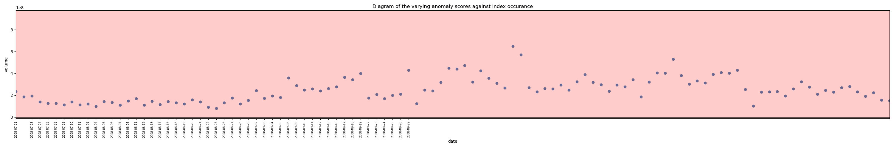

# Finomaly — Anomaly Detection in Financial Market Data

A terminal-based Python tool that trains two unsupervised ML models on historical OHLCV time-series and flags anomalous trading periods in unseen market data, aimed at quantitative analysts and ML researchers.

---

<!-- Hero image: replace with the chart that best demonstrates a detected event -->
> **[IMAGE: hero chart — suggested: Isolation Forest scatter plot for GOOGL 2007–2011 with the 2008 credit-crisis window annotated]**

---

## Key results

- [RESULT: insert number of training assets used]
- [RESULT: insert total flagged-day count for Isolation Forest across test assets]
- [RESULT: insert total flagged-window count for Autoencoder across test assets]
- [RESULT: describe qualitative alignment with a known market event, e.g. 2008 financial crisis, COVID-19 March 2020]

---

## Quickstart

### 1. Install dependencies

CPU is the default supported configuration; CUDA acceleration is optional (see [Hardware](#hardware)).

```bash
pip install -r requirements.txt
```

### 2. Add training data

Place at least 10 valid OHLCV CSV files in:

<!-- Note: me245/ is the current module directory; consider renaming to src/ in a future refactor -->
```
me245/CSV_Files_training_unverified/
```

Files downloaded via option `[0]` are saved here automatically. See [Data format](#data-format) for validation rules.

### 3. Run

Launch from the **project root** (the directory containing `me245/`):

```bash
python me245/main.py
```

Menu options:

```
[0] Extract stock market data    — download OHLCV data from Yahoo Finance
[1] Isolation Forest             — train classical model and generate predictions
[2] Autoencoder                  — train deep learning model and generate predictions
```

---

## How it works

### Data loading (`data_loader.py`)

- **Automatic download**: enter a ticker symbol (e.g. `AAPL`, `^GSPC`) and a date range; the system fetches OHLCV data via `yfinance` with a 2-second inter-request delay to avoid rate limiting. Files are saved as `<TICKER>_<start>_<end>.csv` so the asset and date range are immediately identifiable from the filename.
- **Manual CSV**: drop your own files into the unverified folder; validation runs automatically and promotes passing files.
- **Validation rules**: required columns `date`, `open`, `high`, `low`, `close`, `adjclose`, `volume`; minimum 1 000 rows; no missing values; chronological ordering enforced on load. Files that fail remain in the unverified folder.

Missing values are not imputed — rows with gaps are dropped. Methods such as linear interpolation or forward-fill would introduce artificial regularity that could suppress genuine anomalies.

### Feature engineering (`preprocessor.py`)

Raw OHLCV values are transformed into 15 normalised features per trading day before being passed to either model.

| Feature group | Features | Rationale |
|---|---|---|
| Log returns | `log_adjclose_change`, `log_open_change`, `log_high_change`, `log_low_change`, `log_close_change`, `log_volume_change` | Raw price levels are non-stationary and strongly autocorrelated; log returns are approximately stationary and scale-invariant across assets |
| Rolling divergence | `short_mid_diff_adjclose`, `short_long_diff_adjclose`, `short_mid_diff_volume`, `short_long_diff_volume` | Divergence between short (3-day), medium (6-day), and long (12-day) rolling means — detects momentum shifts in price and volume |
| Intraday structure | `difference_open_close`, `difference_high_low` | Intraday volatility relative to the open price |
| Temporal | `year`, `month`, `season` | Encodes expected seasonal patterns so predictable cyclical behaviour is not flagged as anomalous (see [Known limitations](#known-limitations)) |

Each file is z-score normalised using its own statistics. This acts as a crude per-asset calibration: all files enter training with comparable numeric ranges, at the cost of discarding cross-asset differences in absolute scale and volatility. A corpus-level scaler (fit once on training data, applied unchanged to test data) is a planned alternative and interacts with the training schedule — see [Design decisions](#design-decisions-and-development-status).

### Models

**Isolation Forest** (`classical_model_manager.py`)

All validated training files are feature-extracted, concatenated into a single DataFrame, and used to fit a single `IsolationForest` (200 trees, `n_jobs=-1`). The `contamination` parameter is set to `0.01` — this is an assumed outlier fraction that tells the model roughly what proportion of points to treat as anomalous, not a significance level. The model produces a continuous decision-function score per trading day; scores below zero are labelled anomalous.

**Autoencoder** (`autoencoder.py`, `autoencoder_model_manager.py`)

Each training file is converted into overlapping 60-day sliding windows (one financial quarter). Each window (60 days × 15 features = 900 values) is passed through a fully-connected encoder–decoder network:

```
Encoder:  900 → 90 (Tanh) → 45 (Tanh)
Decoder:  45  → 90 (Tanh) → 900
```

Tanh activations are used on all hidden layers to preserve the negative values that arise from z-score normalisation (ReLU would clip them). The output layer is linear, so reconstructions are not bounded to [-1, 1] and extreme z-scores remain representable.

The input width of 900 is fixed by the window design (60 days × 15 features). Two encoder stages are used rather than a single 900→45 map because one transformation limits what the encoder can express: the intermediate 90-unit layer extracts general features of the window, which the second stage composes into 45 latent factors. The specific widths are proportion-based heuristics (roughly 10% and 5% of input) chosen to force real compression while retaining capacity; sensitivity to these widths has not yet been tested.

The network is trained file-by-file for 20 epochs in batches of 32 windows, using MSE loss and the Adam optimiser (lr = 0.0001).

At inference, windows whose mean reconstruction error exceeds `mean + 2.33 × std` of the test file's error distribution are flagged. The intent is to select roughly the top 1% of windows; because reconstruction errors are right-skewed rather than Gaussian, the realised flag rate varies by dataset. Replacing this cut with an empirical quantile (`torch.quantile(errors, 0.99)`) is planned, which selects exactly the top 1% with no distributional assumption.

---

## Output charts

<!-- Note: File_of_outcomes/ is the current output directory; consider renaming to outputs/ in a future refactor -->
All charts are saved as `.png` files under `me245/File_of_outcomes/<model>/<asset_name>/`. The asset folder name is taken from the CSV filename stem, so the ticker and date range are encoded in the output path (e.g. `File_of_outcomes/Isolation Forest/GOOGL_2007-01-01_2011-01-01/`).

Charts are the primary output format. See [Future work](#future-work) for planned CSV export of flagged rows.

### Isolation Forest

#### `scatter.png` — Anomaly score scatter plot

X-axis: date index of each trading day in the unseen dataset. Y-axis: Isolation Forest decision-function score — more negative means more anomalous. A horizontal black line at y = 0 marks the decision boundary.

- Normal days: steel blue
- Anomalous days (score < 0): red
- X-axis ticks show only flagged dates, rotated 90°

**What to look for:** red clusters in narrow date windows often correspond to identifiable market events — sharp price moves, elevated volatility, or unusual volume or price patterns around market events. Isolated red points scattered across many dates may indicate the assumed contamination fraction needs adjusting, or that the training corpus lacks sufficient representation of that asset class.

*Example — GOOGL 2007-01-01 to 2011-01-01:*


---

#### `histogram.png` — Decision-function score distribution

Overlaid frequency histogram of decision-function scores for the unseen dataset:

- Sky blue bars: days classified as normal
- Salmon bars: days classified as anomalous
- Vertical black line at x = 0: decision boundary

**What to look for:** clear separation between the two populations on either side of the boundary confirms that the assumed contamination fraction is producing a meaningful split. Significant overlap near zero indicates the model is uncertain and some flagged points may be borderline rather than genuine anomalies.

*Example — GOOGL 2007-01-01 to 2011-01-01:*


---

#### `shap.png` — SHAP feature importance

Generated with `shap.TreeExplainer` on the fitted Isolation Forest, applied to anomalous rows only. Bars show mean absolute SHAP value for each feature, sorted descending.

**What to look for:** the leading features indicate the nature of the detected anomalies. Volume-led bars (`log_volume_change`, `short_mid_diff_volume`) suggest volume-driven events; price-led bars (`log_adjclose_change`, `difference_high_low`) suggest price-movement-driven events.

*Example — GOOGL 2007-01-01 to 2011-01-01:*


---

### Autoencoder

#### `<column>.png` — Per-feature time-series plots with anomaly overlays

One plot per raw OHLCV column (`open`, `high`, `low`, `close`, `adjclose`, `volume`), each showing:

- Steel blue scatter: raw daily values against date
- Semi-transparent red bands: 60-day windows whose reconstruction error exceeded the heuristic threshold — consecutive flagged windows are merged into a single wider band
- X-axis ticks: start dates of flagged windows, rotated 90°
- X-axis cropped to the span between the first and last flagged window

**What to look for:** a red band coinciding with a visible spike, dip, or regime change in the plotted column is consistent with the autoencoder detecting a structural transition. In observed behaviour the model responds most strongly to windows containing a shift from calm to volatile conditions (onset detection) rather than windows fully inside a volatile regime. A band over a visually unremarkable section of one column suggests the anomaly was driven by a different feature within the same 60-day window — comparing all six plots for the same asset helps identify the primary driver.

*Example — GOOGL 2007-01-01 to 2011-01-01:*








---

## Interpretability

### Isolation Forest — SHAP

`shap.TreeExplainer` is directly compatible with the Isolation Forest because it is a tree ensemble; SHAP traverses each tree's split structure to compute exact feature attributions. The explainer is applied to anomalous points only, producing the bar chart described above.

### Autoencoder — interpretability

SHAP has not yet been applied to the autoencoder; this is a deferred implementation choice rather than an impossibility. `shap.GradientExplainer` or `shap.KernelExplainer` could be applied by wrapping reconstruction error as a scalar model output. The planned approach is per-feature reconstruction error attribution: comparing the input and reconstructed output dimension-by-dimension to identify which features the network failed to reconstruct accurately in each flagged window.

---

## Known limitations

- **`year` feature extrapolation**: the `year` feature takes values outside the training range on any future data, making such data appear anomalous by construction under a fixed scaler; under the current per-file scaling it instead acts as a monotonic within-file ramp. SHAP attribution shows it contributes little to detections. It is slated for removal; `month` and `season` are retained as they encode recurring cycles.
- **Out-of-distribution threshold behaviour**: the autoencoder's heuristic threshold is derived from the test-set reconstruction error distribution and has not been evaluated on out-of-distribution assets. Threshold behaviour in this setting is under review.
- **Chart title mismatch**: current chart titles reference "anomaly scores" in plots that display raw OHLCV values, and contain a spelling error ("occurance"). Both will be corrected in a future update.

---

## Design decisions and development status

The Isolation Forest and Autoencoder pipelines are deliberately kept as separate, independent classes. A shared `Model` base class covering `train`, `predict`, `save`, and `load` has been deferred because the two models have different serialisation requirements (`joblib` for scikit-learn, `torch.save` for PyTorch), and designing the interface before those are implemented risks a structural rework. Save/load will be built first; the shared abstraction will follow.

The per-file scaler and the file-by-file training schedule interlock: because every file is normalised to the same distribution shape, sequential training behaves near-identically to combined training. If the scaler is changed to a single corpus-level fit, training should simultaneously move to combined, shuffled sequences across all files, otherwise files become genuinely distinct tasks and sequential fine-tuning would bias the model toward the last file trained.

---

## Future work

- Flagged-rows CSV export
- Per-feature reconstruction error attribution for the autoencoder
- Remove `year` feature; evaluate replacement temporal encodings
- Model persistence (save/load) for both models
- GPU device placement (`.to(device)`) for model and batches
- Optional box plot of anomaly scores grouped by season or year

---

## Data format

| Requirement | Detail |
|---|---|
| Required columns | `date`, `open`, `high`, `low`, `close`, `adjclose`, `volume` |
| Minimum rows | 1 000 trading days |
| Missing values | Not permitted — rows with any missing value are dropped |
| Date ordering | Chronological; enforced automatically on load |
| Naming convention | `<TICKER>_<YYYY-MM-DD>_<YYYY-MM-DD>.csv` recommended |

The models learn generalised normal behaviour across all training assets; anomalies are flagged relative to broad market norms, not asset-specific baselines.

---

## Hardware

The code currently runs entirely on CPU; the network is small (900 → 90 → 45) and trains without prohibitive overhead. GPU execution would require adding device placement (`.to(device)`) for the model and batches, and is listed under [Future work](#future-work). The Isolation Forest always runs on CPU and uses all available cores (`n_jobs=-1`).

RAM: no minimum is enforced by the code, but Isolation Forest training concatenates all CSV files into memory simultaneously. 8 GB or more is advisable for large training corpora.

---

## Dependencies

| Library | Purpose |
|---|---|
| `yfinance` | Yahoo Finance OHLCV download |
| `pandas`, `numpy` | Data manipulation and feature engineering |
| `scikit-learn` | Isolation Forest |
| `torch` (PyTorch) | Autoencoder neural network |
| `shap` | Isolation Forest interpretability |
| `matplotlib` | Chart generation |

See `requirements.txt` for pinned versions.

---

## Legal notice

This project uses `yfinance` to access data via the Yahoo Finance API. `yfinance` is not affiliated with Yahoo. Use is subject to Yahoo's Terms of Service: https://policies.yahoo.com/us/en/yahoo/terms/index.htm. See also the yfinance project page: https://pypi.org/project/yfinance/.
